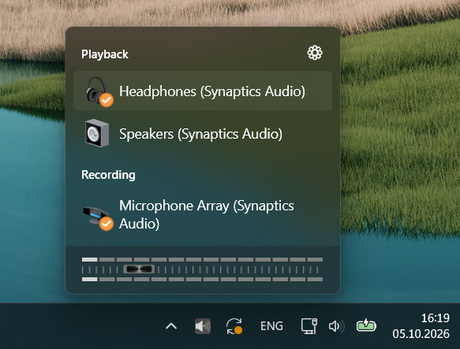

# AudioSwitch

Switch your Windows playback and recording devices, adjust volume, and keep your
favorite audio controls close at hand from the system tray or a keyboard shortcut.

**AudioSwitch v3.1 is the current release!** Please give it a try with
your everyday audio setup and let me know how it goes.



[Downloads](https://github.com/sirWest/AudioSwitch/releases) |
[Report an issue](https://github.com/sirWest/AudioSwitch/issues) |
[Contribute](CONTRIBUTING.md)

## A Little Catch-Up

It has been a while. A busy personal life kept me away from AudioSwitch much
longer than I expected, and I appreciate everyone who stuck around. Hopefully,
v3.0 makes the wait worthwhile.

This version has been converted to .NET 10 and WPF and improved with the help of
Codex and the Astra 6 model. AI-assisted coding has made returning to this project
much more manageable, and I expect it to help me work through future issues and
requests faster, too.

I use the same AI help every day at work, and I stay involved here: I review the
code and changes, check how things behave, and keep an eye on unnecessary bulk
or odd design choices. The aim is a useful, maintainable AudioSwitch that I can
keep looking after. Thank you for giving it another look.

## What's New in v3.1

Get the latest version, **v3.1**, from the
[releases page](https://github.com/sirWest/AudioSwitch/releases/tag/3.1).

- Direct hotkeys for a specific playback device, recording device, or input/output pair.
- Graceful audio-error handling, session-cached unsupported device capabilities,
  confirmed default-device changes, and detailed rotating diagnostic logs.
- An Open error log button in the Settings footer for easy access to diagnostics.
- Windows playback volume and mute OSD when custom OSD is disabled, instead of
  volume notifications. Recording feedback still requires custom OSD.

See [Device Hotkeys](docs/DEVICE-HOTKEYS.md) for setup examples and the
[technical reference](docs/TECHNICAL.md) for native OSD behavior and limitations.

## What's New in v3.0

- A refreshed app built for Windows 10 and 11, using .NET 10 and WPF.
- Light and dark modes, with an option to follow your Windows appearance.
- Playback and recording devices shown together in one list, or separately if
  you prefer.
- Transparency effects on Windows 10 and 11, plus animated flyout opening and
  closing on Windows 11. Effects respect your Windows settings.
- Light and dark OSD skin support, including a new default skin that follows
  the app's appearance.
- 16 additional OSD skins to choose from, bringing the included collection to 25.
- More reliable JSON-based settings, with backup and recovery support and
  automatic migration from v2.0 on the first normal tray launch.
- A separate command-line executable, `audioswitch-cli.exe`, with text and JSON
  output for scripts and automation.

## What's Still Here from v2.0

The familiar AudioSwitch essentials are still here:

- Switch playback and recording devices from the system tray, or cycle through
  them with a quick right-click.
- Adjust volume and toggle mute for both playback and recording.
- Set global hotkeys for device switching, volume, and mute.
- Control volume with the mouse wheel and your chosen modifier keys.
- Give devices friendly names and hide the ones you don't use.
- Choose startup devices for multimedia and communications, and optionally
  switch the communications device along with your main device.
- See volume and device changes in a skinnable on-screen display, with adjustable
  position, opacity, and display time. The original skins are still included.
- Customize device icon colors, keep the device list visible where you want it,
  and start AudioSwitch when you sign in to Windows.

## Try It Out

Get the current v3.1 release from the
[releases page](https://github.com/sirWest/AudioSwitch/releases).
AudioSwitch v3.1 targets Windows 10 and 11. Windows 7, 8, and 8.1 are not
supported by its .NET 10 runtime; older Windows versions are outside this release's
scope. Microsoft's official .NET 10 support on Windows 10 is limited to specific
LTSC and Enterprise releases; see the
[supported OS list](https://github.com/dotnet/core/blob/main/release-notes/10.0/supported-os.md)
for details.

The installer uses x64 executables and requires the **.NET 10 Desktop Runtime
(x64)**. It checks for the runtime but does not install it automatically.
See the [Windows runtime installation guide](https://learn.microsoft.com/dotnet/core/install/windows)
for downloads and supported Windows versions.

Click the tray icon to open your devices, then choose the one you want to use.
Right-click the icon for the menu and Settings. With quick switching enabled,
right-click cycles devices instead; Shift+right-click still opens the menu.
Scroll over the flyout to adjust volume, or right-click the volume slider to mute.

Upgrading from an older version? Start the tray app once to import your old
`Settings.xml`. Your original file is kept, and any existing v3.x settings are
left in place. Settings now live in `%LOCALAPPDATA%/AudioSwitch/settings.json`.

## Help Test It

I'd appreciate feedback on everyday use, especially device switching, hotkeys,
settings upgrades, USB or Bluetooth devices reconnecting, and sleep and resume.

Please [open an issue](https://github.com/sirWest/AudioSwitch/issues) if something
doesn't work as expected. Include your Windows and AudioSwitch versions, the
audio devices involved, and the steps to reproduce it. A short description of
what you expected and what happened helps a lot. Relevant errors may also be in
`%LOCALAPPDATA%/AudioSwitch/errors.log`.

Suggestions and pull requests are welcome, too. Thanks for helping make this
release better.

## Build and Contribute

Install the .NET 10 SDK on Windows, then run these commands from the solution
folder:

```powershell
dotnet build AudioSwitch.sln
dotnet run --project AudioSwitch -- --settings
dotnet test AudioSwitch.sln
```

See the [contribution guide](CONTRIBUTING.md) for development and testing notes,
or the [technical reference](docs/TECHNICAL.md) for command-line options, settings,
installer publishing, and OSD skins.

## Buy Me a Coffee

If AudioSwitch makes your day a little easier, you're welcome to buy me a coffee.
Donations are optional and always appreciated. Testing, reporting issues, and
sharing the app are a big help as well.

[](https://www.paypal.com/donate/?hosted_button_id=2KV5RQBSB8Z9A)

## License

AudioSwitch is free and open source under the [Apache License 2.0](LICENSE).
